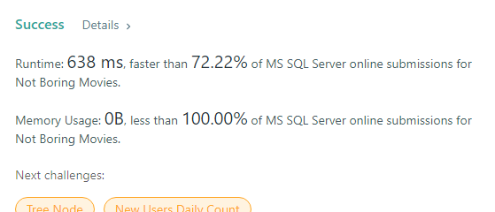
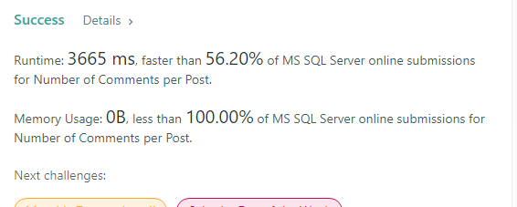
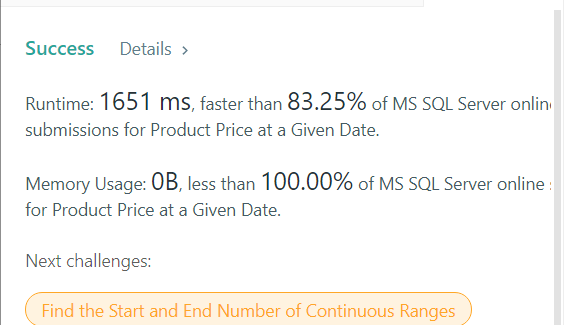
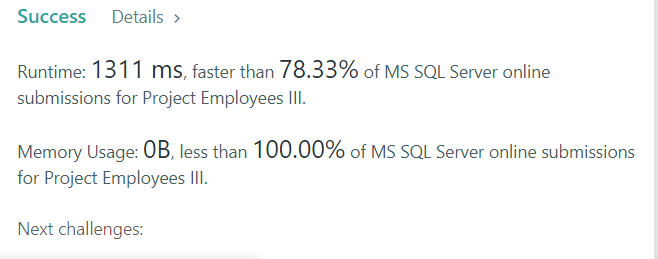

# SQLServer - 100 Days of SQL
挑戰連續 100 天學習 SQL 語法, 除了可以複習之外, 也可以釐清很多不懂的地方。

## Day54 [LeetCode-#1501] Countries You Can Safely Invest In

#### Purpose
> 

#### Column
> country 

#### Skill
> 

#### Code
# Write your MySQL query statement below
    WITH CTE AS (
        SELECT 
            CNT.name AS CNTR_NM,
            CR.duration 
        FROM Person P 
        JOIN Calls CR 
          ON P.id = CR.caller_id 
            OR P.id = CR.callee_id   
        JOIN Country CNT 
          ON CNT.country_code = LEFT(P.phone_number, 3) 
    ) 
    SELECT 
        CNTR_NM AS country
    FROM CTE
    GROUP BY CNTR_NM
    HAVING AVG(duration) > (
        SELECT 
            AVG(duration) AS Glob_AVG
        FROM CTE
     )

#### Success

## Day53 [LeetCode-#1693] Daily Leads and Partners

#### Purpose
> Return the number of distinct lead_id's and distinct partner_id's.

#### Column
> date_id, make_name, unique_leads, unique_partners

#### Skill
> 

#### Code
    SELECT 
        ds.date_id,
        ds.make_name,
        COUNT(DISTINCT lead_id) AS unique_leads,
        COUNT(DISTINCT partner_id) AS unique_partners
    FROM DailySales ds
    GROUP BY ds.date_id, ds.make_name

#### Success

## Day52 [LeetCode-#1587] Bank Account Summary II

#### Purpose
> Find the name and balance of users with a balance higher than 10000. 

#### Column
> name, balance  

#### Skill
> 

#### Code
    SELECT 
        Users.name AS name,
        SUM(Transactions.amount) AS balance
    FROM Transactions
    LEFT JOIN Users
      ON Transactions.account = Users.account
    GROUP BY Users.name
    HAVING SUM(Transactions.amount) > 10000

#### Success

## Day51 [LeetCode-#1581] Customer Who Visited but Did Not Make Any Transactions

#### Purpose
>  Find the IDs of the users who visited without making any transactions and the number of times they made these types of visits.

#### Column
> customer_id, count_no_trans

#### Skill
> 

#### Code
    SELECT 
        v.customer_id,
        COUNT(1) AS count_no_trans
    FROM Visits v 
    LEFT JOIN Transactions t 
      ON v.visit_id = t.visit_id 
    WHERE t.transaction_id IS NULL
    GROUP BY v.customer_id

#### Success

## Day50 [LeetCode-#1050] Actors and Directors Who Cooperated At Least Three Times

#### Purpose
> Find the actors and directors who cooperated at Least three times

#### Column
> actor_id, director_id

#### Skill
> 

#### Code
    SELECT
        actor_id,
        director_id 
    FROM ActorDirector
    GROUP BY actor_id, director_id
    HAVING COUNT(director_id) > 2

#### Success
  

## Day49 Update Snippets in VScode

#### Update snippets

## Day48 [LeetCode-#1571] Warehouse Manager

#### Purpose
> Write an SQL query to report, How much cubic feet of volume does the inventory occupy in each warehouse

#### Column
> warehouse_name, volume

#### Skill
> 

#### Code
    SELECT 
        a.name AS warehouse_name,
        SUM(
            Width * Length * Height * units
        ) AS volume
    FROM Warehouse a
    JOIN Products b
        ON a.product_id = b.product_id
    GROUP BY a.name

#### Success

## Day47 [LeetCode-#1212] Team Scores in Football Tournament

#### Purpose
> 

#### Column
> 

#### Skill
> 

#### Code
    with new_table as (
    select 
        host_team, 
        guest_team, 
        case when host_goals = guest_goals then 1 when host_goals < guest_goals then 0 else 3 end as host_points, 
        case when host_goals = guest_goals then 1 when host_goals > guest_goals then 0 else 3 end as guest_points 
    from 
        matches
    ) 
    select 
    * 
    from 
    (
        select 
        t.team_id as team_id, 
        t.team_name as team_name, 
        coalesce(b.num_points, 0) as num_points 
        from 
        (
            select 
            team_id, 
            sum(total_points) as num_points 
            from 
            (
                select 
                host_team as team_id, 
                sum(host_points) as total_points 
                from 
                new_table 
                group by 
                host_team 
                union all 
                select 
                guest_team as team_id, 
                sum(guest_points) as total_points 
                from 
                new_table 
                group by 
                guest_team
            ) a 
            group by 
            team_id
        ) b 
        right join teams t on b.team_id = t.team_id
    ) c 
    order by 
    c.num_points desc, 
    c.team_id

#### Success

## Day46 [LeetCode-#1350] Students With Invalid Departments

#### Purpose
> 

#### Column
> 

#### Skill
> 

#### Code

#### Success

## Day45 [LeetCode-#1280] Students and Examinations

#### Purpose
> Find the number of times each student attended each exam

#### Column
> student_id, student_name, subject_name, attended_exams

#### Skill
> 

#### Code
SELECT 
    dd.student_id,
    dd.student_name, 
    dd.subject_name,
    ISNULL(
        count(dd.cnt)
        ,
        0
    ) AS attended_exams
FROM (
    SELECT 
        s.student_id,
        s.student_name,
        sub.subject_name,
        e.student_id AS cnt
    FROM students s
    CROSS JOIN subjects sub
    LEFT JOIN examinations e
        ON s.student_id = e.student_id
        AND e.subject_name = sub.subject_name 
) AS dd
GROUP BY dd.student_id, dd.student_name, dd.subject_name

#### Success

## Day44 [LeetCode-1211] Queries Quality and Percentage

#### Purpose
> 

#### Column
>

#### Skill
> 

#### Code

#### Success

## Day43 [Implementation] Use VSCode to create and run T-SQL Script

#### Purpose
> Use VSCode to create and run T-SQL Script

#### Step by Step
> 

#### Code

#### Success

## Day42 Update Snippets in VScode

#### Update snippets

## Day41 [LeetCode-#612] Shortest Distance in a Plane

#### Purpose
> Find the shortest distance in a plane.

#### Column
> shortest

#### Skill
>

#### Code
    SELECT DISTINCT top 1 
        ROUND(
            SQRT(
                POWER(
                    startingPoint.x - endingPoint.x,
                    2
                ) + power(
                    startingPoint.y - endingPoint.y,
                    2
                )
            ),
            2
        ) AS shortest
    FROM point_2d startingPoint
    JOIN point_2d endingPoint
      ON startingPoint.x <> endingPoint.x 
        OR startingPoint.y <> endingPoint.y
    ORDER BY shortest
    

#### Success

## Day40 [LeetCode-#?1435] Create a Session Bar Chart

#### Purpose
> Create a Session Bar Chart

#### Column
> bin, total

#### Skill
> 

#### Code
    SELECT
        '[0-5>' AS bin,
        SUM(
            IIF(
                duration/60 BETWEEN 0 AND 4,
                1,
                0
            )
        ) AS total 
    FROM sessions
    UNION
    SELECT
        '[5-10>' AS bin,
        SUM(
            IIF(
                duration/60 BETWEEN 5 AND 9,
                1,
                0
            )
        ) AS total FROM sessions
    UNION
    SELECT
        '[10-15>' AS bin,
        SUM(
            IIF(
                duration/60 BETWEEN 10 AND 14,
                1,
                0
            )
        ) AS total 
    FROM sessions
    UNION
    SELECT
        '15 or more' AS bin ,
        SUM(
            IIF(
                duration / 60 >= 15,
                1,
                0
            )
        ) AS total FROM sessions

#### Success

## Day39 Create a Stored Procedure

#### Purpose
> Create a Stored Procedure

#### Step by Step

#### Success

## Day38 [LeetCode-#586] Customer Placing the Largest Number of Orders

#### Purpose
> Find the customer who placed maximum numbers of orders

#### Column
> customer_number

#### Skill
> 

#### Code
    SELECT TOP 1 
        customer_number
    FROM orders
    GROUP BY customer_number
    ORDER BY COUNT(*) DESC
#### Success

## Day37 [LeetCode-#603] Consecutive Available Seats

#### Purpose
> Find the consecutive available seats

#### Column
> seat_id

#### Skill
> 

#### Code
    SELECT DISTINCT 
        c.seat_id
    FROM cinema c
    WHERE c.free = 1
    AND EXISTS (
        SELECT
            1
        FROM cinema
        WHEREfree = 1
        AND (
            seat_id = c.seat_id - 1
            OR seat_id = c.seat_id + 1
        )
    )
    ORDER BY c.seat_id

#### Success

## Day36 [LeetCode-#1149] Article Views II

#### Purpose
> Find all the people who viewed more than one article on the same date.

#### Column
> id

#### Skill
>

#### Code
    SELECT DISTINCT
        viewer_id id
    FROM Views
    GROUP BY viewer_id, view_date
    HAVING COUNT(DISTINCT article_id) > 1

#### Success

## Day35 Update Snippets in VScode

#### Update snippets

## Day34 [Issue] TCP Port Is Already In Use

#### Symptoms
> Unable to start SQL Server

#### Resolution
> Excluding the port 1433 with command "netsh int ipv4 add excludedportrange tcp startport=1433 numberofports=1 store=persistent"

#### Cause
> The port 1433 is occupied by Windows OS dynamically assigned port

#### Issue

## Day33 [LeetCode-#1179] Reformat Department Table

#### Purpose
> Reformat the table such that there is a department id column and a revenue column for each month.

#### Column
> id, Jan_Revenue, Feb_Revenue, Mar_Revenue, Apr_Revenue, May_revenue, June_Revenue, July_Revenue, Aug_Revenue, Sept_Revenue, Oct_Revenue, Nov_Revenue, Dec_Revenue

#### Skill
> 

#### Code
    SELECT  
        id,
        [Jan] AS Jan_Revenue,[Feb] AS Feb_Revenue,[Mar] AS Mar_Revenue,[Apr] AS Apr_Revenue,
        [May] AS May_Revenue,[Jun] AS Jun_Revenue,[Jul] AS Jul_Revenue,[Aug] AS Aug_Revenue,
        [Sep] AS Sep_Revenue,[Oct] AS Oct_Revenue,[Nov] AS Nov_Revenue,[Dec] AS Dec_Revenue
    FROM(
        SELECT 
            id,
            revenue,
            month
        FROM Department
    ) AS dep
    PIVOT
    (
        MAX(revenue)
        FOR month IN ([Jan],[Feb],[Mar],[Apr],
                    [May],[Jun],[Jul],[Aug],
                    [Sep],[Oct],[Nov],[Dec])
    ) AS ReFORmat

#### Success

## Day32 [LeetCode-#613] Shortest Distance in a Line

#### Purpose
> Find the shortest distance between two points in these points.

#### Column
> query_name, quality, poor_query_percentage

#### Skill
> Find the distance between any two points on x-axis << ABS("startingPoint" - "sndingPoint")_"" join "table"_"startingPoint" != "endingPoit"

#### Code
    SELECT
        MIN(ABS(startingPoint.x - endingPoint.x)) AS shortest
    FROM point startingPoint 
    JOIN point endingPoint
        ON startingPoint.x != endingPoint.x
    

#### Success

## Day31 [LeetCode-#1173] Immediate Food Delivery I

#### Purpose
> Find the percentage of immediate orders in the table

#### Column
> immediate_percentage

#### Skill
> 

#### Code
    SELECT
        ROUND(
            (
                (
                    (
                    COUNT(t.delivery_id)
                    ) * 1.0 / (
                    SELECT 
                        (
                        COUNT(delivery_id)
                        )* 1.0 
                    FROM 
                        delivery
                    )
                ) * 100
            ), 
            2
        ) AS immediate_percentage 
    FROM 
    (
        SELECT
        delivery_id, 
        CASE
            WHEN order_date = customer_pref_delivery_date THEN 'immediate'
            else 'scheduled' END AS customerDeliveryDate 
        FROM 
        delivery
    ) AS t 
    WHERE 
    t.customerDeliveryDate = 'immediate'

#### Success

## Day30 [LeetCode-#1543] Fix Product Name Format

#### Purpose
> Return table result in specific format.

#### Column
> product_name, sale_date, total

#### Skill
> 

#### Code
    SELECT
        product_name,
        sale_date,
        count(*) AS total
    FROM(
        SELECT 
            lower(ltrim(rtrim(product_name))) product_name,
            convert(varchar(7),sale_date,126) AS sale_date
        FROM Sales
        WHERE year(sale_date) = '2000'
    ) T2
    GROUP BY product_name,sale_date
    ORDER BY product_name,sale_date

#### Success

## Day29 [LeetCode-#1294] Weather Type in Each Country

#### Purpose
> Find the type of weather in each country for November 2019

#### Column
> country_name, weather_type

#### Skill
> 

#### Code
    SELECT 
        country_name,
    CASE 
        WHEN AVG(CAST(Weather.weather_state AS FLOAT)) <= 15 THEN 'Cold'
        WHEN AVG(CAST(Weather.weather_state AS FLOAT)) >= 25 THEN 'Hot'
        ELSE 'Warm'
    END AS weather_type
    FROM Countries
    LEFT JOIN Weather
    ON Countries.country_id = Weather.country_id
    WHERE Weather.day 
    BETWEEN '11/01/2019' 
    AND '11/30/2019'
    GROUP BY country_name

#### Success

## Day28 [LeetCode-#620] Not Boring Movies

#### Purpose
> output movies with an odd numbered ID and a description that is not 'boring'. Order the result by rating.

#### Column
> id, movie, description, rating

#### Skill
> 

#### Code
    SELECT
        id,
        movie,
        description,
        rating
    FROM cinema
    WHERE id % 2 != 0
      AND description != 'boring'
    ORDER By rating DESC

#### Success

## Day27 [LeetCode-#?] Big Countries

#### Purpose
> Find big country

#### Column
> name, population, area

#### Skill
> 

#### Code
    SELECT
        name,
        population,
        area
    FROM World
    WHERE area > 3000000
    OR population > 25000000

#### Success

## Day26 [LeetCode-#1327] List the Products Ordered in a Period

#### Purpose
> get the names of products with greater than or equal to 100 units ordered in February 2020 and their amount

#### Column
> product_name, unit

#### Skill
> 

#### Code
    SELECT
        product_name,
        unit
    FROM Products T1
    INNER JOIN(
        SELECT
            product_id,
            SUM(unit) as unit
        FROM Orders
        WHERE (
            order_date >= '2020-02-01'
            AND order_date < '2020-03-01'
        )
        GROUP BY product_id
    ) T2
      ON T1.product_id = T2. product_id
    WHERE unit >= 100

#### Success

## Day25 [LeetCode-#627] Swap Salary

#### Purpose
> Swap all f and m values with a single update statement and no intermediate temp table

#### Column
> id, name, sex, salary

#### Skill
> sex change

#### Code
UPDATE
    salary
SET sex = 
(
    CASE
        WHEN sex = 'f' THEN 'm'
        WHEN sex = 'm' THEN 'f'
    END
)

#### Success

## Day24 [LeetCode-#1517] Find Users With Valid E-Mails

#### Purpose
> Find the user who have valid emails.

#### Column
> user_id, name, mail

#### Skill
> may contain_LIKE '%[^]%'

#### Code
    SELECT
        *
    FROM Users
    WHERE (
        mail LIKE '[a-z]%' 
    )AND(
        LEFT(mail, LEN(mail) - 13) NOT LIKE '%[^0-9a-zA-Z_.-]%'
    )AND(
        mail LIKE '%@leetcode.com'
    )

#### Success

## Day23 [LeetCode-#610] Triangle Judgement

#### Purpose
> Query to check whether these three line segments can form a triangle

#### Column
> x, y, z, triangle

#### Skill
> CASE + AND

#### Code
    SELECT
        x,
        y,
        z,
    CASE
        WHEN x + y > z
          AND y + z > x
          AND  z + x > y
        THEN 'Yes'
        ELSE 'No'
    END AS triangle
    FROM Triangle

#### Success

## Day22 [LeetCode-#1241] Number of Comments per Post

#### Purpose
> Find the number of comments per post

#### Column
> post_id, number_of_comments

#### Skill

#### Code
    SELECT DISTINCT 
        T1.sub_id AS post_id,
        ISNULL(T2.number_of_comments,0) AS number_of_comments
    FROM submissions T1
    LEFT JOIN
    (
        SELECT DISTINCT 
            parent_id,
            count(DISTINCT sub_id) AS number_of_comments
        FROM submissions
        WHERE parent_id IS NOT NULL
        GROUP BY parent_id
    ) T2
      ON T1.sub_id = T2.parent_id
    WHERE T1.parent_id IS NULL

#### Success

## Day21 [LeetCode-#584] Find Customer Referee

#### Purpose
> Return the list of customers NOT referred by the person with id '2'

#### Column 
> name

#### Skill
>

#### Code
    SELECT
        name
    FROM customer
    WHERE referee_id != 2
      OR referee_id IS NULL

#### Success

## Day20. [LeetCode-#1164] Product Price at a Given Date

#### Purpose
> Find the prices of all products on 2019-08-16

#### Column 
> product_id, price

#### Skill
>

#### Code
    SELECT DISTINCT
        T1.product_id,
        isnull(T2.new_price, 10) AS price
    FROM products T1
    LEFT JOIN
    (
        SELECT 
            a.product_id,
            a.new_price,
            a.change_date
        FROM Products a
        WHERE a.change_date IN 
        (
            SELECT 
                MAX(b.change_date)
            FROM Products b
            WHERE b.product_id = a.product_id
                AND b.change_date <= '2019-08-16'
            GROUP BY b.product_id
        )
    ) T2
    ON T1.product_id = T2.product_id

#### Success

##  Day19. [LeetCode-#1148] Article Views I

#### Purpose
> Find all the authors that viewed at least one of their own articles

#### Column 
> id

#### Skill
> SELECT DISTINCT

#### Code
    SELECT DISTINCT
        viewer_id AS id
    FROM Views
    WHERE author_id = viewer_id 

#### Success

##  Day18. [LeetCode- #1303] Find the Team Size

#### Purpose
> Find the teams size of each of the employees

#### Column 
> employee_id, team_size

#### Skill
> * INNER JOIN + Subquery
> * Count() + group by

#### Code
    SELECT
        employee_id,
        team_size
    FROM employee
    INNER JOIN(
        SELECT
            team_id, COUNT(employee_id) AS team_size
        FROM Employee
        GROUP BY team_id
    )Team
      ON employee.team_id = Team.team_id
    ORDER BY employee_id

#### Success

##  Day17. [LeetCode-#577.]Employee Bonus

#### Purpose
>Select all employee's name and bonus whose bonus is < 1000.

#### Column 
> name, bonus

#### Skill
> LEFT JOIN + OR IS NULL

#### Code
    SELECT
        name,
        bonus
    FROM Employee T1
    LEFT JOIN Bonus T2
      ON T1.empId = T2.empId
    WHERE bonus < 1000 OR bonus IS NULL

#### Success

## Day16. [LeetCode-#181] Employees Earning More Than Their 

#### Purpose
> 找出收入高於主管的員工

#### Column 
> Employee

#### Skill
> Subquery

#### Code
    SELECT
        Name as Employee
    FROM
        Employee E1
    WHERE
        E1.salary > (
            SELECT
               E2.salary
            FROM
                Employee E2
            WHERE
                E1.ManagerId = E2.Id
        )

#### Success

##  Day15. [LeetCode-#183]Customers Who Never Order

#### Purpose
>找出沒有下訂的顧客

#### Column 
Customers

#### Skill
>LEFT JOIN + IS NULL

#### Code
    SELECT
        Name AS Customers
    FROM
        Customers LEFT JOIN Orders
        ON Customers.Id = Orders.CustomerId
    WHERE
        Orders.CustomerId IS NULL

#### Success

##  Day14 [LeetCode-#182] Duplicate Emails

#### Purpose
>找出重複的電子郵件

#### Column 
Email

#### Skill
>GROUP BY <column_name>
 HAVING COUNT(<column_name>) > 1

#### Code
    SELECT
        Email AS Email
    FROM
        Person
    GROUP BY Email
    HAVING  COUNT(Email) > 1

#### Success

## Day13 [LeetCode#176] Second Hightest Salary
使用 MAX() 找出最高的薪水, 在小於最高薪的資料中再找出最高薪。

#### Purpose
>找出第二高薪

#### Code
    SELECT
        MAX(Salary) AS SecondHighestSalary
    FROM Employee
    WHERE Salary < (
        SELECT
            MAX(Salary) 
        FROM Employee
    )

#### Success

## Day12. [LeetCode-#175] Combine Two Tables
#### Purpose
>查找指定欄位

#### Code
    SELECT 
        FirstName,
        LastName,
        City,
        State
    FROM Address right join Person ON Address.PersonId = Person.PersonId

#### Success

## Day11. [LeetCode-#550] Game Play Analysis IV
今天參考網友的做法做了一次, 細節在研究

#### Purpose
>查詢連續兩日都登入的玩家比例

#### Code
	SELECT
		 ROUND(
			CAST(
				COUNT(
					DISTINCT CASE WHEN DATEDIFF(DAY,d1,d2)=1
					  THEN player_id 
					  ELSE null END
				) AS DECIMAL(18,2)
			)/COUNT(DISTINCT player_id),
			2
		) AS fraction
	FROM(
		SELECT 
			player_id,
			event_date d1,
			lead(event_date,1)
			  OVER(
				PARTITION BY player_id
				ORDER BY rk
			) d2
		FROM(
			SELECT 
				player_id,
				event_date,
				DENSE_RANK()OVER(
					PARTITION BY player_id 
					ORDER BY event_date
				) AS rk
			FROM Activity
		) t
	WHERE rk=1 or rk=2) t

#### Success

## Day10. [LeetCode-#534] Game Play Analysis III
今天是 Game play analysis 的第三題, 使用 SUM over 的方式來解題。

#### Purpose
>查詢每個時間點上該名員工已經玩了多少次遊戲

#### SQL
	SELECT 
		player_id,
		event_date,
		sum(games_played)
		 over(
			partition by player_id order by event_date
		) as games_played_so_far
	FROM Activity; 

#### Success

## Day9. [LeetCode-#511, #512] Game Play Analysis I,  Game Play Analysis II

#### Code (I)
	SELECT
		player_id,
		MIN(event_date) AS first_login
	FROM Activity
	GROUP BY player_id

#### Code (II)
	SELECT 
		player_id,
		device_id
	FROM (SELECT
		player_id,
		device_id,
		RANK() OVER (
			PARTITION BY player_id ORDER BY event_date
		) AS RANK
		FROM Activity
	)T2 
	WHERE RANK=1

#### Success (I)

#### Success (II)

## Day8. [LeetCode-#1084] Sales Analysis III

#### Code
    SELECT
        S.product_id, P.product_name
    FROM sales S, product P
    WHERE S.product_id = P.product_id
    GROUP BY S.product_id, P.product_name
    HAVING MIN(S.sale_date) >= '2019-01-01' 
    AND MAX(S.sale_date) <= '2019-03-31'

#### Success

#### References
1. [Can you Join two Tables Without a Common Column?](https://learnsql.com/blog/join-tables-without-common-column/)
2. [Select from two tables:  Example](http://www1.udel.edu/evelyn/SQL-Class2/SQLclass2_2tblEg.html)

## Day7. [LeetCode-#1083] Sales Analysis II
今天使用EXCEPT 來解這題, 雖然可以過關, 不過需要其他更好的解法

#### Code
	SELECT 
		buyer_id 
	FROM sales s, product p 
	WHERE s.product_id=p.product_id and p.product_name='S8'
	EXCEPT
	SELECT
		 buyer_id 
	FROM sales s, product p 
	WHERE s.product_id=p.product_id and p.product_name='iPhone'

#### Success

#### References
* [You Probably don’t Use SQL INTERSECT or EXCEPT Often Enough](https://blog.jooq.org/2015/10/06/you-probably-dont-use-sql-intersect-or-except-often-enough/)

## Day6. [LeetCode-#1082] Sales Analysis I
今天使用 GROUP BY 結合 RANK() 進行分組排序, 找出銷售總額最高的 seller

#### Code
	SELECT
		seller_id
	FROM(
		SELECT
			seller_id,
			RANK()OVER(
				ORDER BY SUM(price) DESC
			) AS totalRank
		FROM Sales
		GROUP BY seller_id
	) AS s
	WHERE totalRank = 1

#### Success

## Day5. [LeetCode-#1070] Product Sales Analysis III
今天使用 GROUP BY 加上 INNER JOIN 完成

#### Code
	SELECT
		S1.product_id,
		S1.year  AS first_year,
		S1.quantity,
		S1.price
	FROM sales S1
	INNER JOIN (
		SELECT 
			S2.product_id,
			min(S2.year) AS year
		FROM sales S2
		GROUP BY S2.product_id
	) AS M
	  ON S1.product_id = M.product_id AND S1.year = M.year

#### Success

## Day4. [LeetCode-#1068, #1068]Product Sales Analysis I, II
特別要注意的是, 在 II 中使用 GROUP BY 加上 SUM() 的用法, 雖然可以通過, 但還是會有 Time Limit Exceeded 的風險。其他更好的解法之後再做紀錄。

#### Code (I)
    SELECT
        product_name,
        year,
        price
    FROM Product P1
    INNER JOIN Sales S1
      ON P1.product_id = S1.product_id

#### Code (II)
    SELECT
        product_id,
        SUM(quantity)	AS total_quantity
    FROM Sales
    GROUP BY product_id

#### Success (I)

#### Success (II)

## Day3. [LeetCode-#1077] Project Employee III
延續前兩天的題目, 今天終於把 Project Emplmoyee 系列的最後一題結束了。
這題的解法是先用 LEFT JOIN 找出各專案最高經驗年數, 然後再做一次 LEFT JOIN 找出所對應的工號

#### Code
    SELECT 
	    Pid1 AS project_id,
	    Emp1 AS employee_id
    FROM(
        SELECT 
		    P1.project_id AS Pid1,
		    P1.employee_id AS Emp1,
		    experience_years AS Years1
	    FROM Project P1
        INNER JOIN Employee E1
          ON P1.employee_id = E1.employee_id) T1
	INNER JOIN(                                 
		SELECT    -- 1>找出專案最多經驗
			P2.project_id AS Pid2,
			MAX(E2.experience_years) AS Years2
		FROM Employee E2
		LEFT JOIN Project P2
		 ON E2.employee_id = P2.employee_id
		GROUP BY project_id) T2
	  ON T1.Pid1 = T2.Pid2 AND T1.Years1 = T2.Years2

#### Success

## Day2. [LeetCode-#1076] Project Employee II
該不會要來個一題多解?!😲

#### Code
    SELECT
        project_id 
    FROM 
        Project 
    GROUP BY project_id
    HAVING COUNT(employee_id) = (
        SELECT TOP 1
            COUNT(employee_id) 
        FROM 
            Project 
        GROUP BY project_id 
  

#### Success

#### References

## Day1. [LeetCode-#1075] Project Employee I
### Hello world~~
最近蠻常解 LeetCode 的題目, 所以第一天就從 LeetCode 開始吧!!

#### Code
    SELECT
        project_id,
        Round(
            Avg(
                CAST(
                    experience_years AS decimal(10,2)
                )
            ),
            2
        ) AS average_years
    FROM Project P 
    INNER JOIN Employee E 
      ON P.employee_id = E.employee_id
    GROUP BY project_id

#### Success

#### References
1. [SQL CAST() inside AVG() for decimal value](https://www.w3resource.com/sql/aggregate-functions/avg-decimal-places-using-cast-within-avg.php)
2. [SQL Server Decimal](https://www.sqlservertutorial.net/sql-server-basics/sql-server-decimal/#:~:text=Overview%20of%20SQL%20Server%20DECIMAL,use%20the%20DECIMAL%20data%20type.&text=In%20this%20syntax%3A,right%20of%20the%20decimal%20point.)
