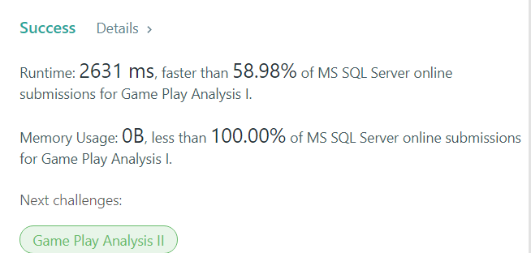

# SQLServer - 100 Days of SQL
挑戰連續 100 天學習 SQL 語法, 除了可以複習之外, 也可以釐清很多不懂的地方。

##  Day15. [LeetCode-#183]Customers Who Never Order

#### Purpose
>找出沒有下訂的顧客

#### Column 
Customers

#### Skill
>LEFT JOIN  + IS NULL

#### Code
    SELECT
        Name AS Customers
    FROM
        Customers LEFT JOIN Orders
        ON Customers.Id = Orders.CustomerId
    WHERE
        Orders.CustomerId IS NULL

#### Success

##  Day14 [LeetCode-#182] Duplicate Emails

#### Purpose
>找出重複的電子郵件

#### Column 
Email

#### Skill
>GROUP BY <column_name> 
HAVING COUNT(<column_name>) > 1

#### Code
    SELECT
        Email AS Email
    FROM
        Person
    GROUP BY Email
    HAVING  COUNT(Email) > 1

#### Success

## Day13 [LeetCode#176] Second Hightest Salary
使用 MAX() 找出最高的薪水, 在小於最高薪的資料中再找出最高薪。

#### Purpose
>找出第二高薪

#### Code
    SELECT
        MAX(Salary) AS SecondHighestSalary
    FROM Employee
    WHERE Salary < (
        SELECT
            MAX(Salary) 
        FROM Employee
    )

#### Success

## Day12. [LeetCode-#175] Combine Two Tables
#### Purpose
>查找指定欄位

#### Code
    SELECT 
        FirstName,
        LastName,
        City,
        State
    FROM Address right join Person ON Address.PersonId = Person.PersonId

#### Success

## Day11. [LeetCode-#550] Game Play Analysis IV
今天參考網友的做法做了一次, 細節在研究

#### Purpose
>查詢連續兩日都登入的玩家比例

#### Code
	SELECT
		 ROUND(
			CAST(
				COUNT(
					DISTINCT CASE WHEN DATEDIFF(DAY,d1,d2)=1
					  THEN player_id 
					  ELSE null END
				) AS DECIMAL(18,2)
			)/COUNT(DISTINCT player_id),
			2
		) AS fraction
	FROM(
		SELECT 
			player_id,
			event_date d1,
			lead(event_date,1)
			  OVER(
				PARTITION BY player_id
				ORDER BY rk
			) d2
		FROM(
			SELECT 
				player_id,
				event_date,
				DENSE_RANK()OVER(
					PARTITION BY player_id 
					ORDER BY event_date
				) AS rk
			FROM Activity
		) t
	WHERE rk=1 or rk=2) t

#### Success

## Day10. [LeetCode-#534] Game Play Analysis III
今天是 Game play analysis 的第三題, 使用 SUM over 的方式來解題。

#### Purpose
>查詢每個時間點上該名員工已經玩了多少次遊戲

#### SQL
	SELECT 
		player_id,
		event_date,
		sum(games_played)
		 over(
			partition by player_id order by event_date
		) as games_played_so_far
	FROM Activity; 

#### Success

## Day9. [LeetCode-#511, #512] Game Play Analysis I,  Game Play Analysis II

#### Code (I)
	SELECT
		player_id,
		MIN(event_date) AS first_login
	FROM Activity
	GROUP BY player_id

#### Code (II)
	SELECT 
		player_id,
		device_id
	FROM (SELECT
		player_id,
		device_id,
		RANK() OVER (
			PARTITION BY player_id ORDER BY event_date
		) AS RANK
		FROM Activity
	)T2 
	WHERE RANK=1

#### Success (I)

#### Success (II)

## Day8. [LeetCode-#1084] Sales Analysis III

#### Code
    SELECT
        S.product_id, P.product_name
    FROM sales S, product P
    WHERE S.product_id = P.product_id
    GROUP BY S.product_id, P.product_name
    HAVING MIN(S.sale_date) >= '2019-01-01' 
    AND MAX(S.sale_date) <= '2019-03-31'

#### Success

#### References
1. [Can you Join two Tables Without a Common Column?](https://learnsql.com/blog/join-tables-without-common-column/)
2. [Select from two tables:  Example](http://www1.udel.edu/evelyn/SQL-Class2/SQLclass2_2tblEg.html)

## Day7. [LeetCode-#1083] Sales Analysis II
今天使用EXCEPT 來解這題, 雖然可以過關, 不過需要其他更好的解法

#### Code
	SELECT 
		buyer_id 
	FROM sales s, product p 
	WHERE s.product_id=p.product_id and p.product_name='S8'
	EXCEPT
	SELECT
		 buyer_id 
	FROM sales s, product p 
	WHERE s.product_id=p.product_id and p.product_name='iPhone'

#### Success

#### References
* [You Probably don’t Use SQL INTERSECT or EXCEPT Often Enough](https://blog.jooq.org/2015/10/06/you-probably-dont-use-sql-intersect-or-except-often-enough/)

## Day6. [LeetCode-#1082] Sales Analysis I
今天使用 GROUP BY 結合 RANK() 進行分組排序, 找出銷售總額最高的 seller

#### Code
	SELECT
		seller_id
	FROM(
		SELECT
			seller_id,
			RANK()OVER(
				ORDER BY SUM(price) DESC
			) AS totalRank
		FROM Sales
		GROUP BY seller_id
	) AS s
	WHERE totalRank = 1

#### Success

## Day5. [LeetCode-#1070] Product Sales Analysis III
今天使用 GROUP BY 加上 INNER JOIN 完成

#### Code
	SELECT
		S1.product_id,
		S1.year  AS first_year,
		S1.quantity,
		S1.price
	FROM sales S1
	INNER JOIN (
		SELECT 
			S2.product_id,
			min(S2.year) AS year
		FROM sales S2
		GROUP BY S2.product_id
	) AS M
	  ON S1.product_id = M.product_id AND S1.year = M.year

#### Success

## Day4. [LeetCode-#1068, #1068]Product Sales Analysis I, II
特別要注意的是, 在 II 中使用 GROUP BY 加上 SUM() 的用法, 雖然可以通過, 但還是會有 Time Limit Exceeded 的風險。其他更好的解法之後再做紀錄。

#### Code (I)
    SELECT
        product_name,
        year,
        price
    FROM Product P1
    INNER JOIN Sales S1
      ON P1.product_id = S1.product_id

#### Code (II)
    SELECT
        product_id,
        SUM(quantity)	AS total_quantity
    FROM Sales
    GROUP BY product_id

#### Success (I)

#### Success (II)

## Day3. [LeetCode-#1077] Project Employee III
延續前兩天的題目, 今天終於把 Project Emplmoyee 系列的最後一題結束了。
這題的解法是先用 LEFT JOIN 找出各專案最高經驗年數, 然後再做一次 LEFT JOIN 找出所對應的工號

#### Code
    SELECT 
	    Pid1 AS project_id,
	    Emp1 AS employee_id
    FROM(
        SELECT 
		    P1.project_id AS Pid1,
		    P1.employee_id AS Emp1,
		    experience_years AS Years1
	    FROM Project P1
        INNER JOIN Employee E1
          ON P1.employee_id = E1.employee_id) T1
	INNER JOIN(                                 
		SELECT    -- 1>找出專案最多經驗
			P2.project_id AS Pid2,
			MAX(E2.experience_years) AS Years2
		FROM Employee E2
		LEFT JOIN Project P2
		 ON E2.employee_id = P2.employee_id
		GROUP BY project_id) T2
	  ON T1.Pid1 = T2.Pid2 AND T1.Years1 = T2.Years2

#### Success

## Day2. [LeetCode-#1076] Project Employee II
該不會要來個一題多解?!😲

#### Code
    SELECT
        project_id 
    FROM 
        Project 
    GROUP BY project_id
    HAVING COUNT(employee_id) = (
        SELECT TOP 1
            COUNT(employee_id) 
        FROM 
            Project 
        GROUP BY project_id 
  

#### Success

#### References

## Day1. [LeetCode-#1075] Project Employee I
### Hello world~~
最近蠻常解 LeetCode 的題目, 所以第一天就從 LeetCode 開始吧!!

#### Code
    SELECT
        project_id,
        Round(
            Avg(
                CAST(
                    experience_years AS decimal(10,2)
                )
            ),
            2
        ) AS average_years
    FROM Project P 
    INNER JOIN Employee E 
      ON P.employee_id = E.employee_id
    GROUP BY project_id

#### Success

#### References
1. [SQL CAST() inside AVG() for decimal value](https://www.w3resource.com/sql/aggregate-functions/avg-decimal-places-using-cast-within-avg.php)
2. [SQL Server Decimal](https://www.sqlservertutorial.net/sql-server-basics/sql-server-decimal/#:~:text=Overview%20of%20SQL%20Server%20DECIMAL,use%20the%20DECIMAL%20data%20type.&text=In%20this%20syntax%3A,right%20of%20the%20decimal%20point.)
